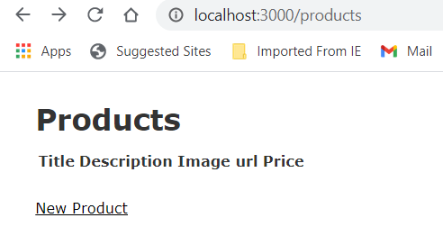

# Webpacker Error

While going through the process of (re)learning [Ruby on Rails with the Pragprog](https://pragprog.com/titles/rails6/agile-web-development-with-rails-6/), I've stretched the boundaries a little by installing Windows Subsystem for Linux [Ubuntu on Windows FTW](https://ubuntu.com/wsl).

I'm tracking my progress in [Github](https://github.com/nryberg/depot), which should be interesting. 

This simplified everything for the installation of Ruby, Rails, Git, etc... *however* ...

After I build a new scaffold for Products, everything **except** the Webpack process goes fine.  Previewing the Products page throws this error:

```bash
ActionView::Template::Error (Webpacker can't find application.js in /home/nick/depot/public/packs/manifest.json. Possible causes:
1. You want to set webpacker.yml value of compile to true for your environment
   unless you are using the `webpack -w` or the webpack-dev-server.
2. webpack has not yet re-run to reflect updates.
3. You have misconfigured Webpacker's config/webpacker.yml file.
4. Your webpack configuration is not creating a manifest.
Your manifest contains:
{
}
):
     6:     <%= csp_meta_tag %>
     7:
     8:     <%= stylesheet_link_tag 'application', media: 'all', 'data-turbolinks-track': 'reload' %>
     9:     <%= javascript_pack_tag 'application', 'data-turbolinks-track': 'reload' %>
    10:   </head>
    11:
    12:   <body>

app/views/layouts/application.html.erb:9

```

# Power Googling

# A) Band-aid

[Rails 6 Band-aid](https://dev.to/andrewmcodes/rails-6-band-aid-for-webpacker-manifest-missingentryerror-1o21)

# B) Vanilla

[Rails Vanilla](https://stackoverflow.com/questions/58065428/rails-vanilla-rails-6-0-error-command-webpack-not-found)

# C) Heroku

 [Heroku on SO](https://stackoverflow.com/questions/51179635/webpacker-cant-find-application-js-in-manifest-json-heroku-production)

**Fix**

`bundle exec bin/webpack-dev-server`

**Result**

```bash
nick@MediumBox:~/depot$ bundle exec bin/webpack-dev-server
internal/modules/cjs/loader.js:883
  throw err;
  ^

Error: Cannot find module 'webpack-cli/bin/config-yargs'
Require stack:
- /home/nick/depot/node_modules/webpack-dev-server/bin/webpack-dev-server.js
    at Function.Module._resolveFilename (internal/modules/cjs/loader.js:880:15)
    at Function.Module._load (internal/modules/cjs/loader.js:725:27)
    at Module.require (internal/modules/cjs/loader.js:952:19)
    at require (internal/modules/cjs/helpers.js:88:18)
    at Object.<anonymous> (/home/nick/depot/node_modules/webpack-dev-server/bin/webpack-dev-server.js:65:1)
    at Module._compile (internal/modules/cjs/loader.js:1063:30)
    at Object.Module._extensions..js (internal/modules/cjs/loader.js:1092:10)
    at Module.load (internal/modules/cjs/loader.js:928:32)
    at Function.Module._load (internal/modules/cjs/loader.js:769:14)
    at Function.executeUserEntryPoint [as runMain] (internal/modules/run_main.js:72:12) {
  code: 'MODULE_NOT_FOUND',
  requireStack: [
    '/home/nick/depot/node_modules/webpack-dev-server/bin/webpack-dev-server.js'
  ]
}
```

# C.2) Cannot find Module

[Cannot find module 'webpack/bin/config-yargs'](https://stackoverflow.com/questions/40379139/cannot-find-module-webpack-bin-config-yargs)

# D) Webpacker Old Version

[Cannot read property .toWebPackConfig](https://github.com/rails/webpacker/issues/2817)

**Solutions**

> Upgrade to latest version of Webpacker

[Webpack Readme](https://github.com/rails/webpacker)

```gemfile
# Gemfile
gem 'webpacker', '~> 6.x'
```

Then 

```bash
bundle
bundle exec rails webpacker:install
```

`Compilation Failed`

```log
Error [BrowserslistError]: /home/nick/depot contains both .browserslistrc and package.json with browsers
```

**Deleted Extraneous Browser list chunk from package.json**

```json
,
  "browserslist": [
    "defaults"
  ]
```

# Success!

